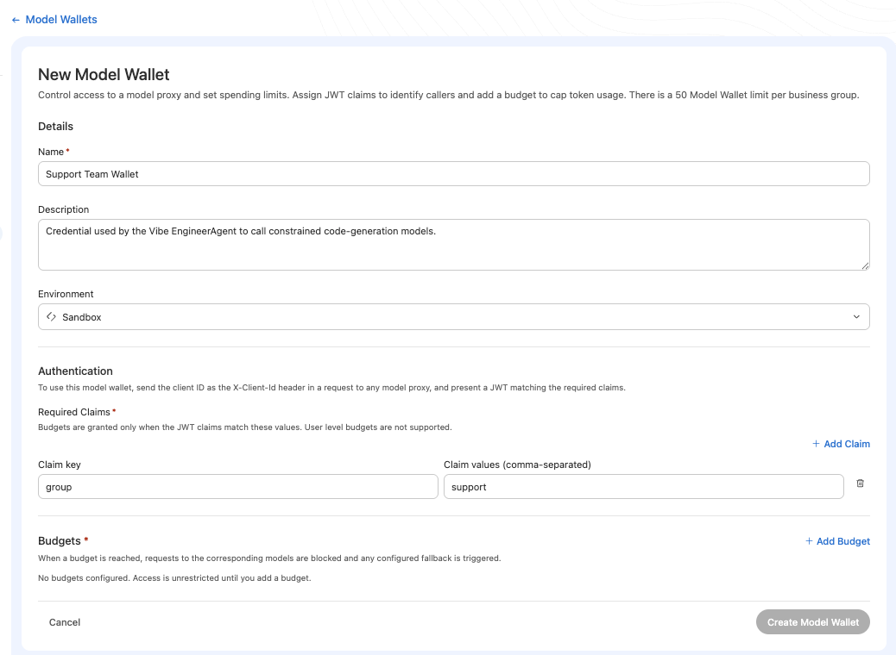
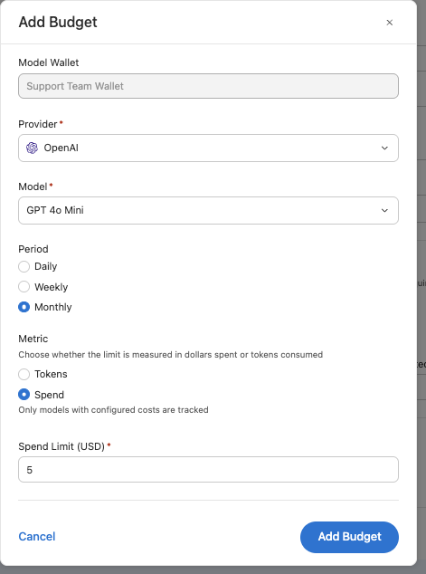
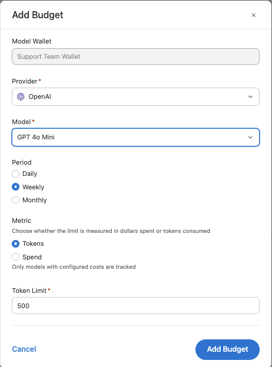
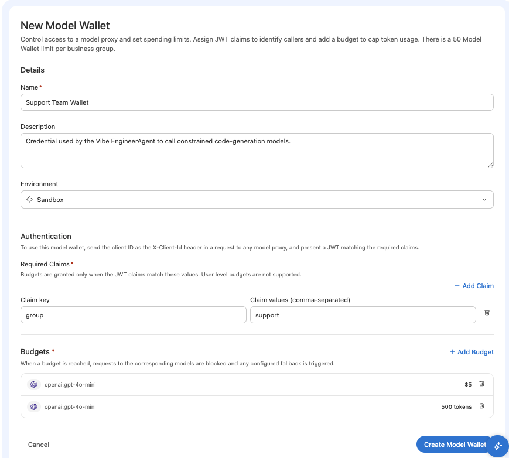

# How to Create the "Support Team Wallet" Model Wallet

This guide walks the **Support Team** through creating a Model Wallet in Agent Fabric that gives the
team access to a model proxy with spending limits.

**How to use this guide:** keep two windows open side by side —

- **This window:** the instructions below.
- **The other window:** Agent Fabric at **omni.mulesoft.com**.

Follow the steps in order and match your screen to the screenshots.

**What you'll create:** a wallet named **Support Team Wallet** that:

- Is used by callers whose access token carries the claim **`group = support`**.
- Limits **GPT-4o Mini** to **$5 per month** and **500 tokens per week**.

| Setting | Value |
|---------|-------|
| Wallet name | Support Team Wallet |
| Environment | Sandbox |
| Required claim | `group` = `support` |
| Budget 1 | OpenAI · GPT-4o Mini · **$5** · Monthly (Spend) |
| Budget 2 | OpenAI · GPT-4o Mini · **500 tokens** · Weekly (Tokens) |

---

## Step 1 — Open the New Model Wallet form

In Agent Fabric, go to **Model Proxies → Model Wallets**, then click **New Model Wallet**.

Fill in the **Details** and **Authentication** sections:

1. **Name:** `Support Team Wallet`
2. **Description:** a short note describing the wallet, e.g.
   *"Credential used by the Support Team to call approved models."*
   *(Make sure this describes the Support Team — don't leave another team's description in here.)*
3. **Environment:** `Sandbox`
4. Under **Required Claims**, set:
   - **Claim key:** `group`
   - **Claim values (comma-separated):** `support`

   > This is what ties the wallet to the team: only requests whose access token has `group = support`
   > will be matched to this wallet and counted against its budget.

Leave the **Budgets** section for the next steps.

---

## Step 2 — Add the first budget ($5 per month)

In the **Budgets** section, click **+ Add Budget**. Fill in the dialog:

| Field | Value |
|-------|-------|
| Provider | **OpenAI** |
| Model | **GPT 4o Mini** |
| Period | **Monthly** |
| Metric | **Spend** |
| Spend Limit (USD) | **5** |

Then click **Add Budget**.

> **Spend** budgets are measured in **dollars**. Only models that have a configured cost are tracked
> this way — GPT-4o Mini has pricing, so its spend is tracked.

---

## Step 3 — Add the second budget (500 tokens per week)

Click **+ Add Budget** again and fill in the dialog:

| Field | Value |
|-------|-------|
| Provider | **OpenAI** |
| Model | **GPT 4o Mini** |
| Period | **Weekly** |
| Metric | **Tokens** |
| Token Limit | **500** |

Then click **Add Budget**.

> This adds a **second** limit on the same model. When you use GPT-4o Mini, **both** limits apply at
> once — the request is blocked as soon as **either** the weekly 500-token limit **or** the monthly
> $5 limit is reached, whichever comes first.

---

## Step 4 — Review and create the wallet

Back on the New Model Wallet form, you should now see **both budgets** listed under **Budgets**:

- `openai:gpt-4o-mini` — **$5**
- `openai:gpt-4o-mini` — **500 tokens**

Confirm the **Required Claims** still shows `group` = `support`, then click **Create Model Wallet**.

---

## Step 5 — Confirm the wallet was created

You'll land on the wallet's detail page:

Check that everything is correct:

| What to confirm | Expected |
|-----------------|----------|
| Wallet name | **Support Team Wallet** |
| **Client ID** | `support-team-wallet` (auto-generated — you'll need this to send requests) |
| **Required Claims** | `group = support` |
| Budget 1 | `gpt-4o-mini` — **$5** — per month |
| Budget 2 | `gpt-4o-mini` — **500 tokens** — per week |

The wallet is now active.

---

## How callers use this wallet

To have a request counted against the Support Team Wallet, the caller must send:

- The header **`X-Client-Id: support-team-wallet`** (the wallet's Client ID), **and**
- An access token (JWT) whose claims include **`group = support`**.

When both are present, requests to GPT-4o Mini are metered against the two budgets above, and once a
limit is reached the requests are blocked (and any configured fallback is triggered).

---

## Next: test the wallet

To verify the wallet matches, enforces its budgets, and appears in Cost Management, use the
Support Team test guide in this same folder — it already has the `group = support` tokens ready to
copy and paste:

- **[How to test the Model Wallet](../how-to-test-the-model-wallet/)** — copy-and-paste test walkthrough for the Support Team
  Wallet. Its appendix shows how to generate a `group = support` access token with jwt.io.

---

## Notes

- **50-wallet limit:** there is a maximum of **50 Model Wallets per business group**.
- **Spend vs. Tokens:** *Spend* budgets need the model to have a configured cost; *Token* budgets
  always work. GPT-4o Mini supports both.
- **User-level budgets are not supported** — budgets apply to everyone whose token matches the claim.
